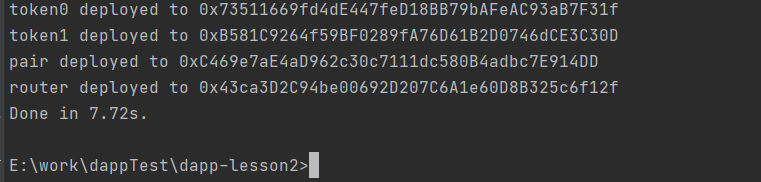
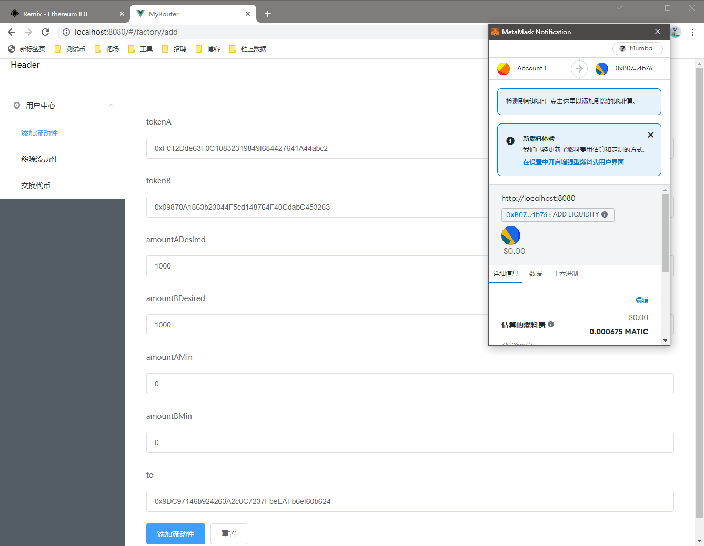

# Sample Hardhat Protocol

## install dependencies
```
yarn
```

## compile contracts
```
yarn compile
```

## start a local node
```
yarn localnode
```

## deploy contracts
modify ```hardhat.config.ts``` and run
```
yarn deploy
```

for examples:
```
heco_testnet: {
    url: "https://http-testnet.hecochain.com",
    chainId: 256,
    accounts: ["0x..."]
},
```

## test contracts
```
yarn test
```

# 完成的功能

1. 增加/移出流动性

   发放LP Token，移除流动性时按比例发放奖励

2. 交易功能

3. 实现手续费功能，千分之三手续费

4. 实现滑点功能

5. 实现部署脚本

## 测试


## 部署



# 加分项-前端功能演示

## 添加流动性



## 移除流动性


## 交换

