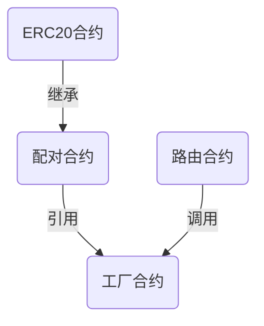

## 实验内容
## 参考Uniswap合约源码


### 源码结构


> Uniswap在Github上面开源了全部合约代码,其中包括`核心合约`,`周边合约`两部分.Uniswap还开源了前端代码,前端代码使用React开发


- [核心合约](https://github.com/Uniswap/uniswap-v2-core)


- [周边合约](https://github.com/Uniswap/uniswap-v2-periphery)


- [前端代码](https://github.com/Uniswap/uniswap-interface)


> 在Uniswap的核心代码中,主要包含3个合约:`工厂合约`,`配对合约`,`ERC20合约`.其中配对合约继承了ERC20合约,我们可以把它们看作一个合约.工厂合约通过`create2`方法部署配对合约,所以在部署合约时`只需要部署工厂合约`.


> 周边合约中包括一些示例代码,例如价格预言机,闪电交换,其中最重要的是`路由合约`.在周边合约的代码库中,包含两个`路由合约`:`UnsiwapV2Router01`,`UnsiwapV2Router02`.工厂合约和配对合约需要通过路由合约调用才能更好的完成交易所的全部功能,所以我们`还要部署路由合约`


两个合约大部分相同,有小部分不同,如果将两个合约的差异化合并成一个合约,部署的时候将会出现`out of gas`,所以才被分成了两个合约.常用功能两个合约中都包括,所以我们部署其中任意一个路由合约都可以





### 浏览器中的合约源码


- [工厂合约](https://cn.etherscan.com/address/0x5C69bEe701ef814a2B6a3EDD4B1652CB9cc5aA6f#code)


- [路由合约01](https://cn.etherscan.com/address/0xf164fc0ec4e93095b804a4795bbe1e041497b92a#code)[可选]


- [路由合约02](https://cn.etherscan.com/address/0x7a250d5630b4cf539739df2c5dacb4c659f2488d#code)


## 部署合约   

### 使用remix部署合约

> 将工厂合约和路由合约的线上版本导入到remix中,在编译合约的选项中,EVM VERSION选择`istanbul`,COMPILER CONFIGURATION中选择`Enable optimization`


> 部署工厂合约


> 部署路由合约


## 部署前端代码

### 修改路由地址


> 在Uniswap的前端中以常量的形式定义了Uniswap的路由地址,我们只需要修改路由地址就可以让前端链接到你的路由合约中


> 修改文件: `项目目录/uniswap-interface/src/constants/addresses.ts` 

```js
import { FACTORY_ADDRESS as V2_FACTORY_ADDRESS } from '@uniswap/v2-sdk'
import { FACTORY_ADDRESS as V3_FACTORY_ADDRESS } from '@uniswap/v3-sdk'

import { constructSameAddressMap } from '../utils/constructSameAddressMap'
import { SupportedChainId } from './chains'

type AddressMap = { [chainId: number]: string }

export const UNI_ADDRESS: AddressMap = constructSameAddressMap('0x1f9840a85d5aF5bf1D1762F925BDADdC4201F984')

export const UNISWAP_NFT_AIRDROP_CLAIM_ADDRESS = '0x8B799381ac40b838BBA4131ffB26197C432AFe78'

export const V2_FACTORY_ADDRESSES: AddressMap = constructSameAddressMap(V2_FACTORY_ADDRESS)
export const V2_ROUTER_ADDRESS: AddressMap = constructSameAddressMap('0x8ce31Ef933ed0cb63258FfD4F9b1EaFbe2d3a97A')//修改为自己部署的路由合约地址

```

> 本地进行运行检查


## 测试添加流动性

> 部署ERC20 token


> 添加代币地址后添加流动性（比例为1:500）


